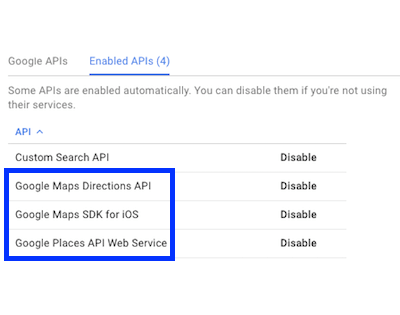
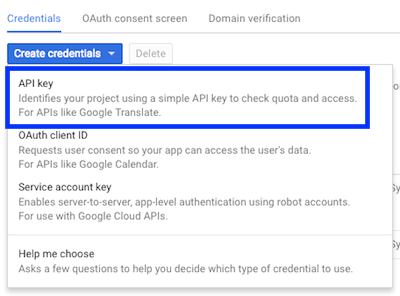

# ASJGooglePlaces

This library is a collection of classes that act as a wrapper around a few features of the Google Places and the Maps Directions REST APIs. Note that if you are using Google Maps SDK in your project, you will probably not need this library. The Maps SDK contains classes that provide the functionality that you get from this library and I recommend you use them over this.

# Installation

CocoaPods is the preferred way to install this library. Add this command to your `Podfile`:

```ruby
pod 'ASJGooglePlaces'
```

# Prerequisites

Most APIs require a key to work. The Maps Directions API is an exception that is used here. To create a key, head over to [Google's API console](https://code.google.com/apis/console), enable the APIs you need and generate your key(s) in the credentials section.




Note that you will need API keys to run the example project. You need one browser key to make API requests and one iOS key configured for the bundle identifier of the project; used to show the directions on a `GMSMapView`.

# Usage

Before doing anything else, you need to set up your API key. Typically, this is done in `AppDelegate.m`. Import `#import "ASJGooglePlaces.h"` and in your `didFinishLaunchingWithOptions:` method, add:

```objc
[ASJConstants sharedInstance].apiKey = @"api_key";
```

If you are using Google Maps in your app, you will need to `#import <GoogleMaps/GMSServices.h>` and add this line:

```objc
[GMSServices provideAPIKey:@"api_key"];
```

There are five classes that you can use that invoke different APIs:

1. `ASJAutocompleteAPI` ([details](https://developers.google.com/places/web-service/autocomplete))
2. `ASJDirectionsAPI` ([details](https://developers.google.com/maps/documentation/directions))
3. `ASJPlaceDetailsAPI` ([details](https://developers.google.com/places/web-service/details))
4. `ASJPlaceIDAPI` ([details](https://developers.google.com/places/place-id))
5. `ASJPlacePhotosAPI` ([details](https://developers.google.com/places/web-service/photos))

### ASJAutocompleteAPI

```objc
- (void)autocompleteForQuery:(NSString *)query completion:(AutocompleteBlock)completion;
```

For a provided query, this method returns an array of `ASJPlace`s that match the input. Google will by default provide five places at a time.


```objc
@property (assign, nonatomic) NSUInteger minimumQueryLength;
```

To control the minimum length of the query before the autocomplete query should run.

### ASJDirectionsAPI

```objc
- (void)directionsFromOriginNamed:(NSString *)origin destinationNamed:(NSString *)destination completion:(DirectionsBlock)completion;

- (void)directionsFromOrigin:(CLLocationCoordinate2D)origin destination:(CLLocationCoordinate2D)destination completion:(DirectionsBlock)completion;
```

These methods get the directions polyline between two places; an 'origin' and a 'destination'. They can be provided either as `NSString`s or by their coordinates. Both methods will return an array of `ASJDirections` that contain the following information:

- Name of 'origin'
- Name of 'destination'
- Coordinates of 'origin'
- Coordinates of 'destination'
- Polyline between the two places

The polyline can be used to draw a `GMSPolyline` between the two places on a `GMSMapView`. Refer the example project to see how it can be done.

### ASJPlaceDetailsAPI

```objc
- (void)placeDetailsForPlace:(NSString *)place completion:(PlaceDetailsBlock)completion;

- (void)placeDetailsForPlaceID:(NSString *)placeID completion:(PlaceDetailsBlock)completion;
```

These methods fetch the details corresponding to a place. You can either provide the name of a place or the unique place ID assigned to one. You can obtain this by the Place ID API. The result of either method will be an `ASJPlaceDetails` object in the completion. It can return `nil` if no details are available.

**Note**: Some of the following info can be `nil` depending on their availability:

- Place name
- Address
- Phone
- Website
- Coordinates
- Photos

### ASJPlaceIDAPI

```objc
- (void)placeIDForPlace:(NSString *)place completion:(PlaceIDBlock)completion;
```

Provide a name of a place and get the corresponding unique place ID in the completion. Returns `nil` if none was found. This ID is assigned by Google.

### ASJPlacePhotosAPI

```objc
- (void)placePhotosForPlace:(NSString *)place completion:(PlacePhotosBlock)completion;

- (void)placePhotosForPlaceID:(NSString *)place completion:(PlacePhotosBlock)completion;
```

Returns an array of `ASJPhoto`s for a provided place name or ID. It will return `nil` if there are no available photos for the place or if the place itself was not found.

# To-do

- ~~Refactor project and library.~~
- ~~Add documentation.~~
- ~~Add place photos by place ID.~~
- Add nullability annotations.
- Add more info to models.
- Handle invalid user inputs.

# Credits

- To **Deepti Walde** for adding code to get all available directions

# License

`ASJGooglePlaces` is available under the MIT license. See the LICENSE file for more info.
